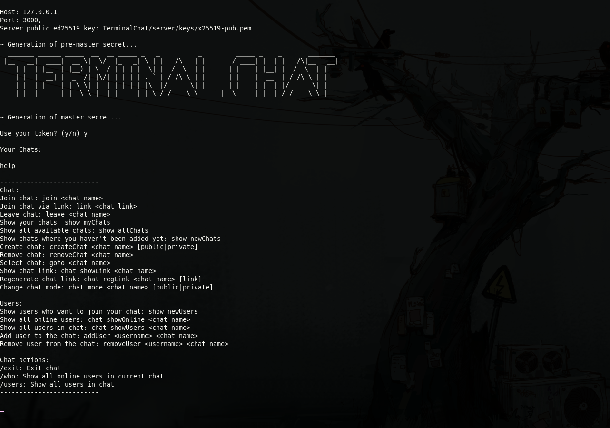

# TerminalChat (End-to-End Encryption)


## 1. Clone the repository:
```
git clone https://github.com/ElviraKukhtaruk/TerminalChat.git
```

## 2. Generate Key Pair (X25519)
For the server (private key):
```
openssl genpkey -algorithm x25519 -out x25519-priv.pem
```
For clients (public key):
```
openssl pkey -in x25519-priv.pem -pubout -out x25519-pub.pem
```
### Move keys into the proper directory
```
mkdir -p TerminalChat/server/keys
mv ./x25519-priv.pem TerminalChat/server/keys
mv ./x25519-pub.pem TerminalChat/server/keys
```
## 3. Run the Server
Configure database settings:
```
TerminalChat/server/configuration/mainConfig-template.js
```
Rename
```
mv TerminalChat/server/configuration/mainConfig-template.js TerminalChat/server/configuration/mainConfig.js
```
### Simple Docker Setup (for testing):
Redis
```
docker run \
  --name redis_server \
  -p 6379:6379 \
  -v redis_data:/data \
  redis:7 \
  redis-server --appendonly yes
```
PostgreSQL
```
docker run \
  --name postgres_db \
  -e POSTGRES_USER=myuser \
  -e POSTGRES_PASSWORD=mypassword \
  -e POSTGRES_DB=mydb \
  -p 5432:5432 \
  -v pg_data:/var/lib/postgresql/data \
  postgres:16
```
These commands will start Redis and PostgreSQL locally with persistent volumes.

Start the server:
```
cd TerminalChat/server
node index.js
```

## 4. Connect with node (Clients):

```
node TerminalChat/client/start.js host port path_to_public_server_key
```

Example:

```
node TerminalChat/client/start.js 127.0.0.1 3000 TerminalChat/server/keys/x25519-pub.pem
```
